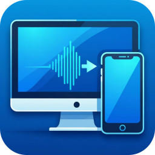
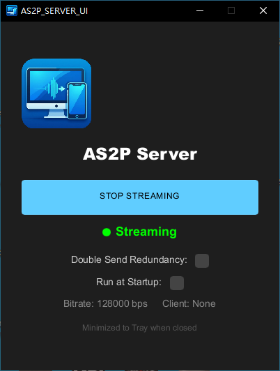
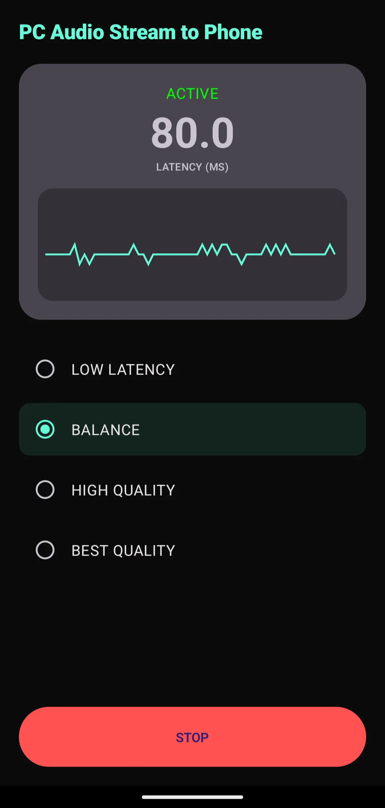

# PC Audio Stream to Phone (AS2P)

<p align="center">
  
</p>

**PC Audio Stream to Phone (AS2P)** is a specialized, open-source solution for real-time, low-latency audio streaming from your Windows PC to an Android device.

## Screenshots
<p align="center">
  
  
</p>

### ⚠️ Special Disclaimer
**All code in this project (including the Windows Server and Android App) was automatically generated by the Gemini CLI.**  
*   The developer has conducted basic functional testing and confirmed it is operational.
*   The developer **has not conducted a line-by-line manual code review** or refactoring of the internal logic and security mechanisms.
*   This project is currently in the **Prototype** stage and is intended for Proof of Concept (PoC) purposes.

---

## Why AS2P?

There are several audio streaming solutions available on the market (e.g., AudioRelay, SoundWire, VBAN), but many are:      
*   **Proprietary/Closed Source**: You don't know what's happening under the hood.
*   **Paid/Subscription Based**: Features like high-quality audio or low latency are often locked behind a paywall.
*   **Over-complicated**: They often include complex routing features that users don't need for a simple PC-to-phone bridge.

**AS2P** is built to be a **Free, Open-Source, and Lightweight** alternative. It focuses on one thing and doing it well: **Streaming high-quality audio with minimal latency and maximum stability.**

---

## Key Features
*   **Zero Bloat**: No ads, no tracking, no complex setup. Just connect and listen.
*   **Modern Visual Interface**: 
    *   **Windows**: Centralized, lightweight interface with "Run at Startup" support.
    *   **Android**: Material Design 3 Dark Theme with a **Dynamic Latency Chart** and **MediaStyle Notification**.
*   **High Performance Architecture**:
    *   **Decoupled Worker Thread**: Moves audio decoding out of the playback callback to eliminate glitches caused by CPU throttling.
    *   **PCM FIFO Buffer**: Uses a thread-safe circular buffer to absorb system-level performance jitter.
    *   **Oboe Exclusive Mode**: Direct hardware access for the lowest possible round-trip latency.
*   **Smart Persistence**: Automatically remembers your last used Latency Preset.
*   **Battery Optimization**: Proactively requests exemption to ensure glitch-free audio in background.
*   **Ultra-Low Latency (Pulse Architecture)**: 
    *   **UDP Port Unification**: Uses a single port (12345) for all traffic to maximize firewall penetration.
    *   **Jitter Buffer Catch-up**: Automatically drops old packets to maintain a strict latency target.
    *   **Double-Send Redundancy**: Server supports optional double-send mode to mitigate Wi-Fi interference.
*   **High Fidelity**: Uses the **Opus Codec** at 48kHz Stereo with **PLC (Packet Loss Concealment)** support.
*   **Anti-Clipping**: 10ms linear Fade-out/Fade-in on all transitions (Start/Stop/Device Change).
*   **CPU Efficient**: Optimized Windows server; stops UI updates when hidden to consume < 0.1% CPU.
*   **Background Stable**: Uses **Foreground Service** on Android to prevent system throttling, with a persistent Media controls.
*   **Smart Disconnect**: Server automatically returns to Listening state if the connection is lost for 5 seconds.

## Supported Platforms

### Windows (Server)
*   **Tested**: Windows 10/11 (x64).
*   **Optimized**: Specifically designed to work flawlessly in background modes.

### Android (Client)
*   **Minimum**: Android 9.0 (Pie / API 28).
*   **Recommended**: Android 13/14/15.
*   **Hardware**: Fully supports 16KB page size environments (e.g., Pixel 6a).

---

## Technical Stack
*   **Backend (Rust)**: `cpal` for capture, `rubato` for resampling, `audiopus` for encoding, **Slint** for the GUI.
*   **Mobile (Kotlin/C++)**: `Oboe` (C++) for low-latency playback, `Jetpack Compose` for UI.
*   **Protocol**: **AS2P Pulse V8** (Custom UDP-based protocol).

---

## Initial Setup

### 1. Windows Audio Settings
To ensure the best audio quality:
*   Open **Sound Settings** on your Windows PC.
*   Set your default output device format to **48000 Hz (Studio Quality)**.

### 2. Firewall Configuration
The server communicates over **UDP Port 12345**.
*   Ensure your firewall allows inbound/outbound traffic on this port for both Server and Client.

---

## How to Use

### 1. Launch Server
1.  Run `server.exe`. By default, the console window is hidden for a cleaner experience.
2.  **Debug Console**: If you need to see logs or troubleshoot, open **CMD** or **PowerShell** and run:
    ```bash
    ./server.exe --debug
    ```
3.  **Arguments**:
    *   `--debug`: Enables detailed connection and audio logs.
    *   `--drop-rate <0.0-1.0>`: Simulates packet loss for testing stability (e.g., `0.1` for 10% loss).

### 2. Connect Client
1.  Open the Android app.
2.  Click **CONNECT**. It will broadcast a discovery signal and link with the server instantly.
3.  **Background Streaming**: You can now safely switch to other apps or turn off your screen. The connection will remain active until you click STOP or swipe away the app.
4.  **Spotify-style Notification**: Control the stream directly from your notification tray or lock screen.

### 3. Adjust Presets
Choose between **LOW_LATENCY**, **BALANCE**, **HIGH_QUALITY**, and **BEST_QUALITY** depending on your Wi-Fi stability.

## Troubleshooting
*   **Rapid Preset Switching**: Switching presets too quickly (multiple clicks in a second) may cause the server to fall behind in reconfiguration, potentially leading to a temporary loss of audio streaming. If this happens, wait a few seconds or click **STOP** then **CONNECT** again.
*   **Microsoft Defender Warning**: On some systems, the "Run at Startup" feature might trigger a false positive in Defender. This is due to the combination of network activity and audio capture in an unsigned executable. We have implemented delayed initialization to mitigate this.
*   **Zombie Icon**: Fixed in V8. Clicking Quit now removes the tray icon immediately.
*   **Mechanical Noise**: Ensure Windows is set to 48kHz, though the server now resamples automatically.
*   **No Audio Captured**: Ensure your PC is playing sound through the default output device.
## License
Licensed under the [MIT License](LICENSE).